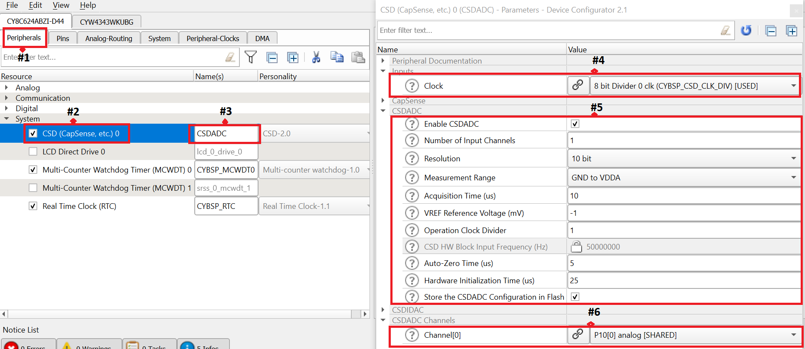

# PSoC 6 MCU: CSDADC
This example demonstrates the usage of CSD analog-to-digital converter (ADC) in PSoC® 6 MCU. The CSDADC measures the external voltage and displays the conversion result in the terminal application. This example uses the [CSDADC Middleware Library](https://github.com/cypresssemiconductorco/csdadc).

Tested with Mbed OS v6.2.1 

## Requirements


- Programming Language: C/C++

- Associated Parts: All [PSoC® 6 MCU](http://www.cypress.com/PSoC6) parts

- [Mbed CLI](https://github.com/ARMmbed/mbed-cli)

- [ModusToolbox v2.1](https://www.cypress.com/documentation/software-and-drivers/modustoolbox-software-archives)

    **Note:** You do not need to install ModusToolbox to build and run this code example. However, installing it is required when you need to:

  * Debug using the Eclipse for ModusToolbox IDE. See the [user guide](https://www.cypress.com/MTBEclipseIDEUserGuide#page=23) for details.
  * Customize the default device configuration using any of the Configurator tools
  * Port this code example to a new target that is not listed under the **Supported Kits**

## Supported Toolchains (Mbed CLI argument `--toolchain`)

- [GNU Arm® Embedded Compiler v9.2.1](#https://developer.arm.com/open-source/gnu-toolchain/gnu-rm/downloads) (GCC_ARM)
- [Arm compiler v6.14](#https://developer.arm.com/tools-and-software/embedded/arm-compiler/downloads/version-6) (ARM)

## Supported Kits (Mbed CLI argument `--target`)

- [PSoC 6 Wi-Fi BT Prototyping Kit](https://www.cypress.com/CY8CPROTO-062-4343W) (CY8CPROTO-062-4343W)
- [PSoC 6 WiFi-BT Pioneer Kit](https://www.cypress.com/CY8CKIT-062-WiFi-BT) (CY8CKIT-062-WIFI-BT)
- [PSoC 6 BLE Pioneer Kit](https://www.cypress.com/CY8CKIT-062-BLE) (CY8CKIT-062-BLE)
- [PSoC 62S2 Wi-Fi BT Pioneer Kit](https://www.cypress.com/CY8CKIT-062S2-43012) (CY8CKIT-062S2-43012)
- [PSoC 62S1 Wi-Fi BT Pioneer Kit](https://www.cypress.com/CYW9P62S1-43438EVB-01) (CYW9P62S1-43438EVB-01)
- [PSoC 62S1 Wi-Fi BT Pioneer Kit](https://www.cypress.com/CYW9P62S1-43012EVB-01) (CYW9P62S1-43012EVB-01)
- [PSoC 62S3 Wi-Fi BT Prototyping Kit](https://www.cypress.com/CY8CPROTO-062S3-4343W) (CY8CPROTO-062S3-4343W)


## Hardware Setup

This example uses the board's default configuration. See the kit user guide to ensure that the board is configured correctly. Place a potentiometer as shown in Table 1 to vary the input voltage to be measured by the ADC. To change the CSDADC input pin, modify the [CSDADC configuration](#enabling-the-csdadc-functionality).

**Table 1. CSDADC Input Pin**

| Kit                  | CSDADC Input Pin         |
|:---------------------|--------------------------|
| CY8CPROTO-062-4343W  | P10 [0]                  |
| CY8CKIT-062-BLE      | P10 [0]                  |
| CY8CKIT-062-WIFI-BT  | P10 [0]                  |
| CY8CKIT-062S2-43012  | P10 [0]                  |
| CYW9P62S1-43438EVB-01| P10 [0]                  |
| CYW9P62S1-43012EVB-01| P10 [0]                  |
| CY8CPROTO-062S3-4343W| P9 [1]                   |

**Note:** The PSoC 6 BLE Pioneer Kit (CY8CKIT-062-BLE) and the PSoC 6 WiFi-BT Pioneer Kit (CY8CKIT-062-WIFI-BT) ship with KitProg2 installed. The ModusToolbox software requires KitProg3. Before using this code example, make sure that the board is upgraded to KitProg3. The tool and instructions are available in the [Firmware Loader](https://github.com/cypresssemiconductorco/Firmware-loader) GitHub repository. If you do not upgrade, you will see an error like "unable to find CMSIS-DAP device" or "KitProg firmware is out of date".

For Mbed OS, the kit must be in DAPLink mode. See the **KitProg3 User Guide** (Documentation tab in the [Cypress Programming Solutions](https://www.cypress.com/products/psoc-programming-solutions) web page) for details of how to put the Pioneer Kit into DAPLink mode.

## Software Setup

Install a terminal emulator if you don't have one. Instructions in this document use [Tera Term](https://ttssh2.osdn.jp/index.html.en).

This example requires no additional software or tools.

## Import the Code Example using Mbed CLI Tool

Mbed CLI commands are used to import the code example and compile. See [Working with Mbed CLI web page](https://os.mbed.com/docs/mbed-os/v6.2/tools/working-with-mbed-cli.html).

```
mbed import https://github.com/cypresssemiconductorco/mbed-os-example-csdadc
```

This command first clones the code example repository from GitHub, and then deploys all the libraries. If you wish to perform the *deploy* process manually, do the following: 

Clone the GitHub code example repository:

```
git clone https://github.com/cypresssemiconductorco/mbed-os-example-csdadc && cd mbed-os-example-csdadc
```

Deploy the dependent libraries. The library files are identified with *.lib* extension.

```
mbed deploy
```

Set the current directory as *root*:

```
mbed new .
```

## Operation

1. Connect the board to your PC using the provided USB cable through the KitProg3 USB connector.

2. Program the board.

      ```
      mbed compile -m <TARGET> -t <TOOLCHAIN> --flash --sterm
      ```

      For instance, to build for the target `CY8CPROTO_062_4343W` with `GCC_ARM` toolchain, use the following command:

      ```
      mbed compile -m CY8CPROTO_062_4343W -t GCC_ARM --flash --sterm
      ```

   **Note:** With the `--sterm` option, Mbed CLI opens a new terminal with 9600-8N1 as the setting after programming completes. Do not use this option if you want to connect using another serial terminal application such as PuTTY or Tera Term.
   
3.  After programming, the application starts automatically. Confirm that the terminal application displays the message as shown in Figure 1.

**Figure 1. Output in UART Terminal**


4. Turn the knob of the potentiometer and observe that the new ADC count is printed on the serial terminal.

## Debugging

You can debug the example to step through the code. In the IDE, use the **\<Application Name> Debug (KitProg3_MiniProg4)** configuration in the **Quick Panel**. For more details, see the "Program and Debug" section in the [Eclipse IDE for ModusToolbox User Guide](https://www.cypress.com/MTBEclipseIDEUserGuide).

Follow the steps from [Eclipse IDE for ModusToolbox User Guide](https://www.cypress.com/MTBEclipseIDEUserGuide#page=23) to export the Mbed OS code example and import it into ModusToolbox IDE for programming and debugging.

Mbed OS also supports debugging using any IDE that supports GDB. We recommend the user to go through [ARM Mbed's documentation](https://os.mbed.com/docs/mbed-os/v6.2/debug-test/index.html) on the debugging steps.

**Note:** **(Only while debugging)** On the CM4 CPU, some code in `main()` may execute before the debugger halts at the beginning of `main()`. This means that some code executes twice - before the debugger stops execution, and again after the debugger resets the program counter to the beginning of `main()`. See [KBA231071](https://community.cypress.com/docs/DOC-21143) to learn about this and for the workaround.

## Design and Implementation

In this example, the CSD block is configured as an ADC with 10-bit resolution, one input channel with the GND-to-VDDA range, and single-shot conversion mode. For more details on CSDADC, see the [CSDADC Middleware Library](https://github.com/cypresssemiconductorco/csdadc). 

The CSDADC could be configured by the ModusToolbox CSD personality. See the [Configuration Considerations](https://cypresssemiconductorco.github.io/csdadc/csdadc_api_reference_manual/html/index.html#group_csdadc_configuration) section in the CSDADC API Reference Guide for configuring the CSDADC.

A GPIO pin is configured as the analog input to CSDADC and a UART resource is used for displaying terminal messages.

The CSDADC is not enabled in the default board configuration provided by the BSP. This example overrides the `BSP_DESIGN_MODUS` component provided with the BSP to enable and configure the CSDADC. See the "Overriding the BSP Configuration Files" section of the [ModusToolbox User Guide](http://www.cypress.com/ModusToolboxUserGuide): *{ModusToolbox install directory}/ide_{version}/docs/mtb_user_guide.pdf*

The *design.modus* file containing the custom device configuration used in this application is present under the respective kit's folder: *\<application_folder>/COMPONENT_CUSTOM_DESIGN_MODUS/TARGET_\<kit>/design.modus*.

#### Enabling the CSDADC Functionality
Do the following to set up the CSDADC middleware for the CSDADC operation using the [Device Configurator](https://www.cypress.com/ModusToolboxDeviceConfig) tool.

1. Open */<user_home>/ModusToolbox/tools_2.1/device-configurator/device-configurator* to run the [Device Configurator](https://www.cypress.com/ModusToolboxDeviceConfig) tool.

2. Select **File** > **Open**. Navigate to and open *design.modus* file for the respective kit: *\<application_folder>/TARGET_\<kit>/CUSTOM_BSP_DESIGN_MODUS/design.modus*. 

3. When prompted to find device support library, select the "devicesupport.xml" from *\<application_folder>/mbed-os/targets/TARGET_Cypress/TARGET_PSOC6/psoc6pdl/*
**Note:** Ensure that the command `mbed deploy` is executed prior to this step.

4. On the **System** tab, configure the **CLK_PERI** frequency to achieve the desired frequency. This is the clock input to the CSDADC.

5. On the **Peripherals** tab (#1 in Figure 2), enable the **CSD** personality under **System** (#2 in Figure 2) and enter the **Alias** (#3 in Figure 2).

6. Go to the **Parameters** Pane and configure the CSD personality:

   1. Assign the peripheral clock divider by using the **Clock** combo box (#4 in Figure 2). Any free divider can be used.

   2. Set the **Enable CSDADC** check box (#5 in Figure 2). 
   
   3. Configure the CSDADC parameters (Resolution, Measurement Range, and Number of Channels (#5 in Figure 2).

   4. Assign pins for the CSDADC Channels (#6 in Figure 2).

7. Select **File** > **Save** to generate the initialization code. This is executed as  part of the `init_cycfg_all()` function, which is called by `cybsp_init()`.

    **Figure 2. Settings to Enable CSDADC Functionality**

    

## Operation at a Custom Power Supply Voltage

The application is configured to work with the default operating voltage of the kit. Table 2 lists the power supply voltages supported by each kit along with the default operating voltage. 

**Table 2. Operating Voltages Supported by the Kits**

| Kit                   | Supported Operating Voltages | Default Operating Voltage |
| :-------------------- | ---------------------------- | ------------------------- |
| CY8CPROTO-062-4343W   | 3.3 V / 1.8 V                | 3.3 V                     |
| CY8CKIT-062-BLE       | 3.3 V / 1.8 V                | 3.3 V                     |
| CY8CKIT-062-WIFI-BT   | 3.3 V / 1.8 V                | 3.3 V                     |
| CY8CKIT-062S2-43012   | 3.3 V / 1.8 V                | 3.3 V                     |
| CYW9P62S1-43438EVB-01 | 3.3 V Only                   | 3.3 V                     |
| CYW9P62S1-43012EVB-01 | 1.8 V Only                   | 1.8 V                     |
| CY8CPROTO-062S3-4343W | 3.3 V / 1.8 V                | 3.3 V                     |

For kits that support multiple operating voltages, do the following to work at a custom power supply, such as 1.8 V:

1. Open */<user_home>/ModusToolbox/tools_2.1/device-configurator/device-configurator* to run the [Device Configurator](https://www.cypress.com/ModusToolboxDeviceConfig) tool.

2. Select **File** > **Open**. Navigate to and open *design.modus* file for the respective kit: *\<application_folder>/TARGET_\<kit>/CUSTOM_BSP_DESIGN_MODUS/design.modus*.

3. Update the operating conditions as shown in Figure 3 and select **File** > **Save**.

   **Figure 3. Power Settings to Work with 1.8 V**

   

4. Change the jumper/switch setting as follows: 

    **Table 3. Jumper/Switch Position for 1.8-V Operation**

    | Kit                   | Jumper/Switch Position         |
    |:----------------------|--------------------------------|
    | CY8CPROTO-062-4343W   | J3 (1-2)                       |
    | CY8CKIT-062-BLE       | SW5 (1-2)                      |
    | CY8CKIT-062-WIFI-BT   | SW5 (1-2)                      |
    | CY8CKIT-062S2-43012   | J14 (1-2)                      |
    | CYW9P62S1-43438EVB-01 | J14 (1-2)                      |
    | CYW9P62S1-43012EVB-01 | J14 (1-2)                      |
    | CY8CPROTO-062S3-4343W | J3 (1-2)                       |

5. Re-build and program the application to evaluate the application at the new power setting.


### Resources and Settings

**Table 1. Application Resources**

| Resource  |  Alias/Object     |    Purpose     |
| :------- | :------------    | :------------ |
| CSDADC (Middleware) | csdadc_context | CSDADC middleware instance that provides an ADC solution using the CSD HW block for measurements |

## Related Resources

| Application Notes                                            |                                                              |
| :----------------------------------------------------------- | :----------------------------------------------------------- |
| [AN228571](https://www.cypress.com/AN228571) – Getting Started with PSoC 6 MCU on ModusToolbox | Describes PSoC 6 MCU devices and how to build your first application with ModusToolbox |
| [AN221774](https://www.cypress.com/AN221774) – Getting Started with PSoC 6 MCU on PSoC Creator | Describes PSoC 6 MCU devices and how to build your first application with PSoC Creator |
| [AN210781](https://www.cypress.com/AN210781) – Getting Started with PSoC 6 MCU with Bluetooth Low Energy (BLE) Connectivity on PSoC Creator | Describes PSoC 6 MCU with BLE Connectivity devices and how to build your first application with PSoC Creator |
| [AN215656](https://www.cypress.com/AN215656) – PSoC 6 MCU: Dual-CPU System Design | Describes the dual-CPU architecture in PSoC 6 MCU, and shows how to build a simple dual-CPU design |
| **Code Examples**                                            |                                                              |
| [Using ModusToolbox](https://github.com/cypresssemiconductorco/Code-Examples-for-ModusToolbox-Software) | [Using PSoC Creator](https://www.cypress.com/documentation/code-examples/psoc-6-mcu-code-examples) |
| **Device Documentation**                                     |                                                              |
| [PSoC 6 MCU Datasheets](https://www.cypress.com/search/all?f[0]=meta_type%3Atechnical_documents&f[1]=resource_meta_type%3A575&f[2]=field_related_products%3A114026) | [PSoC 6 Technical Reference Manuals](https://www.cypress.com/search/all/PSoC%206%20Technical%20Reference%20Manual?f[0]=meta_type%3Atechnical_documents&f[1]=resource_meta_type%3A583) |
| **Development Kits**                                         | Buy at www.cypress.com                                       |
| [CY8CKIT-062-BLE](https://www.cypress.com/CY8CKIT-062-BLE) PSoC 6 BLE Pioneer Kit | [CY8CKIT-062-WiFi-BT](https://www.cypress.com/CY8CKIT-062-WiFi-BT) PSoC 6 WiFi-BT Pioneer Kit |
| [CY8CPROTO-063-BLE](https://www.cypress.com/CY8CPROTO-063-BLE) PSoC 6 BLE Prototyping Kit | [CY8CPROTO-062-4343W](https://www.cypress.com/CY8CPROTO-062-4343W) PSoC 6 Wi-Fi BT Prototyping Kit |
| [CY8CKIT-062S2-43012](https://www.cypress.com/CY8CKIT-062S2-43012) PSoC 62S2 Wi-Fi BT Pioneer Kit | [CY8CPROTO-062S3-4343W](https://www.cypress.com/CY8CPROTO-062S3-4343W) PSoC 62S3 Wi-Fi BT Prototyping Kit |
| [CYW9P62S1-43438EVB-01](https://www.cypress.com/CYW9P62S1-43438EVB-01) PSoC 62S1 Wi-Fi BT Pioneer Kit | [CYW9P62S1-43012EVB-01](https://www.cypress.com/CYW9P62S1-43012EVB-01) PSoC 62S1 Wi-Fi BT Pioneer Kit |                                                              |
| **Libraries**                                                 |                                                              |
| PSoC 6 Peripheral Driver Library (PDL) and docs  | [psoc6pdl](https://github.com/cypresssemiconductorco/psoc6pdl) on GitHub |
| Cypress Hardware Abstraction Layer (HAL) Library and docs     | [psoc6hal](https://github.com/cypresssemiconductorco/psoc6hal) on GitHub |
| Retarget IO - A utility library to retarget the standard input/output (STDIO) messages to a UART port | [retarget-io](https://github.com/cypresssemiconductorco/retarget-io) on GitHub |
| **Middleware**                                               |                                                              |
| CapSense® library and docs                                    | [capsense](https://github.com/cypresssemiconductorco/capsense) on GitHub |
| Links to all PSoC 6 MCU Middleware                           | [psoc6-middleware](https://github.com/cypresssemiconductorco/psoc6-middleware) on GitHub |
| **Tools**                                                    |                                                              |
| [Eclipse IDE for ModusToolbox](https://www.cypress.com/modustoolbox)     | The cross-platform, Eclipse-based IDE for IoT designers that supports application configuration and development targeting converged MCU and wireless systems.             |
| [PSoC Creator™](https://www.cypress.com/products/psoc-creator-integrated-design-environment-ide) | The Cypress IDE for PSoC and FM0+ MCU development.            |

## Other Resources

Cypress provides a wealth of data at www.cypress.com to help you select the right device, and quickly and effectively integrate it into your design.

For PSoC 6 MCU devices, see [How to Design with PSoC 6 MCU - KBA223067](https://community.cypress.com/docs/DOC-14644) in the Cypress community.

## Document History

Document Title: *CE231010* - *PSoC 6 MCU CSDADC*

| Version | Description of Change                                        |
| ------- | ------------------------------------------------------------ |
| 1.0.0     | Initial release. <br>Tested with mbed-os v5.13.1 and CSDADC middleware v2.0. |
| 2.0.0   | Updated to Mbed OS 6.2.1<br>Major code changes - updated CE with custom design.modus file|
------

All other trademarks or registered trademarks referenced herein are the property of their respective owners.


-------------------------------------------------------------------------------

© Cypress Semiconductor Corporation, 2020. This document is the property of Cypress Semiconductor Corporation and its subsidiaries ("Cypress"). This document, including any software or firmware included or referenced in this document ("Software"), is owned by Cypress under the intellectual property laws and treaties of the United States and other countries worldwide. Cypress reserves all rights under such laws and treaties and does not, except as specifically stated in this paragraph, grant any license under its patents, copyrights, trademarks, or other intellectual property rights. If the Software is not accompanied by a license agreement and you do not otherwise have a written agreement with Cypress governing the use of the Software, then Cypress hereby grants you a personal, non-exclusive, nontransferable license (without the right to sublicense) (1) under its copyright rights in the Software (a) for Software provided in source code form, to modify and reproduce the Software solely for use with Cypress hardware products, only internally within your organization, and (b) to distribute the Software in binary code form externally to end users (either directly or indirectly through resellers and distributors), solely for use on Cypress hardware product units, and (2) under those claims of Cypress's patents that are infringed by the Software (as provided by Cypress, unmodified) to make, use, distribute, and import the Software solely for use with Cypress hardware products. Any other use, reproduction, modification, translation, or compilation of the Software is prohibited.  
TO THE EXTENT PERMITTED BY APPLICABLE LAW, CYPRESS MAKES NO WARRANTY OF ANY KIND, EXPRESS OR IMPLIED, WITH REGARD TO THIS DOCUMENT OR ANY SOFTWARE OR ACCOMPANYING HARDWARE, INCLUDING, BUT NOT LIMITED TO, THE IMPLIED WARRANTIES OF MERCHANTABILITY AND FITNESS FOR A PARTICULAR PURPOSE. No computing device can be absolutely secure. Therefore, despite security measures implemented in Cypress hardware or software products, Cypress shall have no liability arising out of any security breach, such as unauthorized access to or use of a Cypress product. CYPRESS DOES NOT REPRESENT, WARRANT, OR GUARANTEE THAT CYPRESS PRODUCTS, OR SYSTEMS CREATED USING CYPRESS PRODUCTS, WILL BE FREE FROM CORRUPTION, ATTACK, VIRUSES, INTERFERENCE, HACKING, DATA LOSS OR THEFT, OR OTHER SECURITY INTRUSION (collectively, "Security Breach"). Cypress disclaims any liability relating to any Security Breach, and you shall and hereby do release Cypress from any claim, damage, or other liability arising from any Security Breach. In addition, the products described in these materials may contain design defects or errors known as errata which may cause the product to deviate from published specifications. To the extent permitted by applicable law, Cypress reserves the right to make changes to this document without further notice. Cypress does not assume any liability arising out of the application or use of any product or circuit described in this document. Any information provided in this document, including any sample design information or programming code, is provided only for reference purposes. It is the responsibility of the user of this document to properly design, program, and test the functionality and safety of any application made of this information and any resulting product. "High-Risk Device" means any device or system whose failure could cause personal injury, death, or property damage. Examples of High-Risk Devices are weapons, nuclear installations, surgical implants, and other medical devices. "Critical Component" means any component of a High-Risk Device whose failure to perform can be reasonably expected to cause, directly or indirectly, the failure of the High-Risk Device, or to affect its safety or effectiveness. Cypress is not liable, in whole or in part, and you shall and hereby do release Cypress from any claim, damage, or other liability arising from any use of a Cypress product as a Critical Component in a High-Risk Device. You shall indemnify and hold Cypress, its directors, officers, employees, agents, affiliates, distributors, and assigns harmless from and against all claims, costs, damages, and expenses, arising out of any claim, including claims for product liability, personal injury or death, or property damage arising from any use of a Cypress product as a Critical Component in a High-Risk Device. Cypress products are not intended or authorized for use as a Critical Component in any High-Risk Device except to the limited extent that (i) Cypress's published data sheet for the product explicitly states Cypress has qualified the product for use in a specific High-Risk Device, or (ii) Cypress has given you advance written authorization to use the product as a Critical Component in the specific High-Risk Device and you have signed a separate indemnification agreement.  
Cypress, the Cypress logo, Spansion, the Spansion logo, and combinations thereof, WICED, PSoC, CapSense, EZ-USB, F-RAM, and Traveo are trademarks or registered trademarks of Cypress in the United States and other countries. For a more complete list of Cypress trademarks, visit cypress.com. Other names and brands may be claimed as property of their respective owners.
